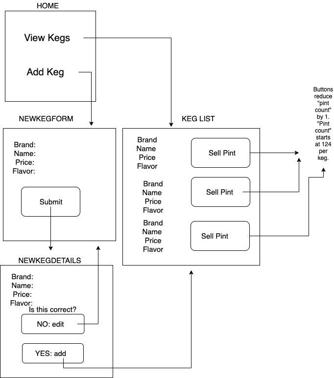

# _Kombucha House_

#### _An Website for employees and patrons of Lauren's Kombucha House. Users can check keg flavors, prices, and volumes. November 2019_

#### By _**Lauren Musante**_

## Description

_This is a website where a user can view what flavors of kombucha the kombucha house has. User can also check the price and description of each kombucha. As the kombucha is sold, there is a button for each flavor that will keep track of how many pints are left in each keg. Persistence to retain pint count number is not yet implemented. _

  

## Setup/Installation Requirements

_Clone [this repository](https://github.com/LaurenMusante/Kombucha-House) to your desktop. Navigate to the root directory in Terminal, then run "npm install" to install all packages and plug-ins needed. Once this step is complete, run "npm run start" in Terminal, and then alt-click on " http://localhost:8083/". Alternatively, you can copy " http://localhost:8083/" into your browser to view the page._

## Known Bugs

_None_

## Support and contact details

_Questions, comments, and feedback, please email: Lauren.Musante@gmail.com_

## Technologies Used

_JavaScript, React, CSS_

### License

*Open source*

Copyright (c) 2019 **_Lauren Musante_**